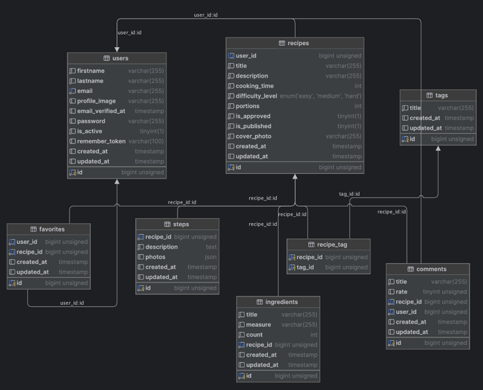

# CookCraft Backend

## Description
CookCraft is the backend for a culinary recipe exchange platform. It is developed using PHP and the Laravel framework, providing flexibility, high performance, and easy scalability. The project allows users to create, edit, and share recipes, as well as interact with other platform participants.

## Features
- **Recipe Management**: Create, edit, and search for recipes.
- **Social Functions**: Commenting, rating recipes, interacting with other users.
- **Monetization**: Introducing paid subscriptions and commercial offers of exclusive content.
- **Authentication and Authorization**: Secure login and session management using Laravel Sanctum.
- **RESTful API**: Interacting with client applications through a unified API.

## Technologies
- **PHP**: The main programming language for the backend.
- **Laravel**: A PHP framework for rapid and secure web application development.
- **MySQL**: A reliable relational database management system.
- **DigitalOcean**: A cloud platform for hosting and scaling the project.

## Database

